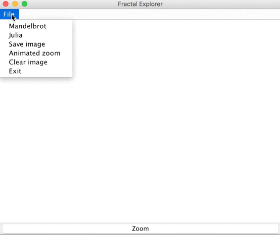
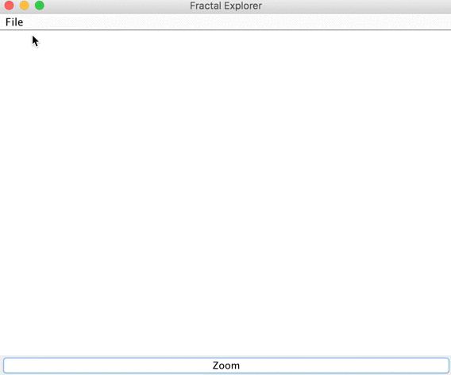
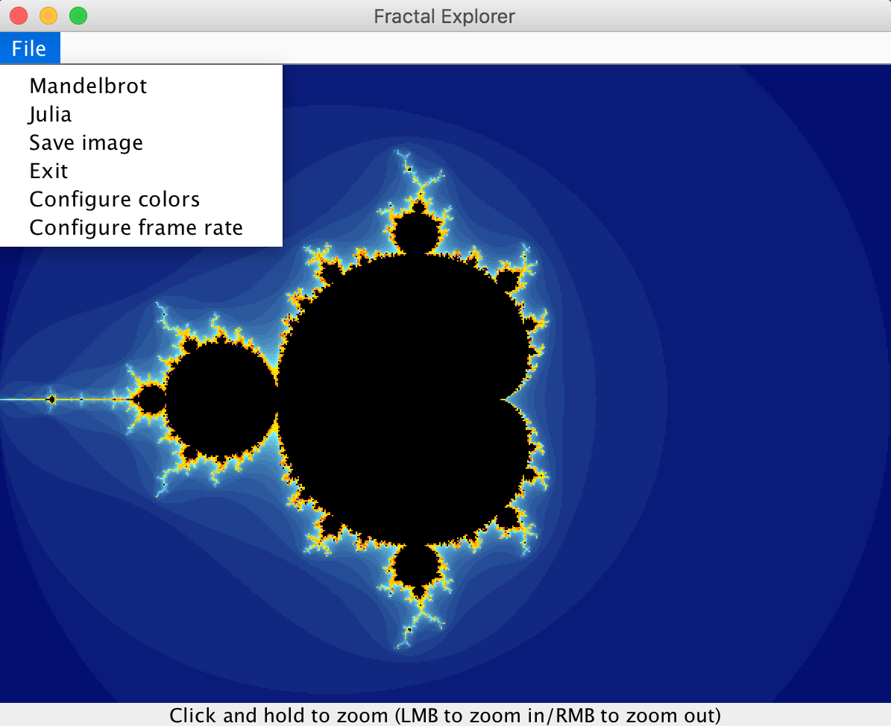

# Mandelbrot and Julia set explorer 
<!-- ## Coursework from Dave Small's Intro to Digital Arts & Sciences. -->

## To compile and run:

>> git clone https://github.com/thomas1242/Fractal-Explorer

>> cd Fractal-Explorer

>> javac FractalExplorer_v2.java && java FractalExplorer_v2

####Move the mouse cursor to control where you zoom.

 
 
 
 

>> javac FractalExplorer_v1.java && java FractalExplorer_v1

####Select a region and zoom.

 
 
 
 
####Configure colors and frame rate

 
